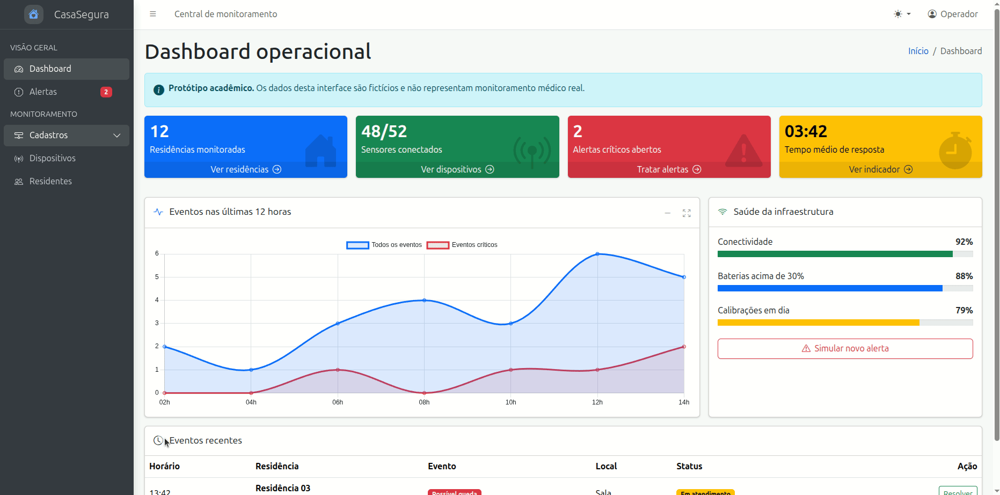
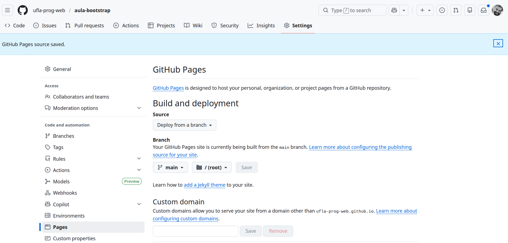

# Aula de Introdução ao Framework AdminLTE

<p align="center">
  <a href="#">
    
  </a>
  <a href="#">
    
  </a>
  <a href="#">
    
  </a>
</p>

## Índice

* [Introdução](#introdução)
* [Recursos Utilizados](#recursos-utilizados)
* [Fundamentos Teóricos](#fundamentos-teóricos)
* [Objetivo da Aula](#objetivo-da-aula)
* [Desenvolvimento do Projeto](#desenvolvimento-do-projeto)
* [Desenvolva Novos Projetos](#desenvolva-novos-projetos)
* [Referências e Materiais de Apoio](#referências-e-materiais-de-apoio)

## Introdução

<a href="#índice"></a>

O objetivo deste tutorial é apresentar o desenvolvimento de uma interface administrativa utilizando **HTML, CSS, JavaScript e AdminLTE**. Como exemplo prático, será construído um dashboard para um sistema fictício de monitoramento de casas inteligentes chamado **CasaSegura**.

A interface permitirá visualizar indicadores de residências e sensores, acompanhar eventos em um gráfico, consultar alertas em uma tabela, simular um novo alerta, marcar um alerta como resolvido e alternar entre os temas claro e escuro.

O projeto será exclusivamente de **camada de apresentação**. Portanto, não haverá backend, banco de dados, autenticação real ou armazenamento permanente. Os dados serão inseridos diretamente no HTML e as alterações realizadas com JavaScript existirão apenas enquanto a página estiver aberta. Ao recarregar o navegador, a página voltará ao estado inicial.

A aula está organizada no formato de tutorial incremental. Em cada etapa, novos elementos serão adicionados para demonstrar como o AdminLTE utiliza componentes do Bootstrap e uma estrutura própria de layout para construir painéis administrativos responsivos.

## Recursos Utilizados

<a href="#índice"></a>

A seguir estão listados os principais recursos empregados no desenvolvimento desta aula.

### Linguagens

* **HTML** - Responsável pela estrutura do conteúdo
    * [Link do curso da W3Schools](https://www.w3schools.com/html/default.asp)
* **CSS** - Responsável pela apresentação visual
    * [Link do curso da W3Schools](https://www.w3schools.com/css/default.asp)
* **JavaScript** - Responsável pelo comportamento e interatividade
    * [Link do curso da W3Schools](https://www.w3schools.com/js/default.asp)

### Frameworks e bibliotecas

* **AdminLTE** - Sistema de template de painel administrativo;
  * [Site do AdminLTE](https://adminlte.io/)
  * [Repositório do AdminLTE](https://github.com/ColorlibHQ/AdminLTE)
* **Bootstrap** - Framework CSS;
  * [Site do Bootstrap](https://getbootstrap.com/)
* **Bootstrap Icons** - Biblioteca CSS para ícones;
  * [Site do Bootstrap Icons](https://icons.getbootstrap.com/)
* **Chart.js** - Biblioteca para criar gráficos.
  * [Site do Chart.js](https://www.chartjs.org/)

### Ferramentas

* **Visual Studio Code** - Ambiente de Desenvolvimento Integrado - [Link](https://code.visualstudio.com/)
* **Git** - Sistema de controle de versão - [Link](https://git-scm.com/)
* **Github** - Plataforma de hospedagem e colaboração em projetos de software - [Link](https://github.com/)
* **Live Server** (Extensão VS Code) - Servidor web para desenvolvimento local - [Link](https://marketplace.visualstudio.com/items?itemName=ritwickdey.LiveServer)
* **http.server** - Servidor web simples incluído na biblioteca padrão do Python - [Link](https://docs.python.org/3/library/http.server.html)

## Fundamentos Teóricos

<a href="#índice"></a>

A seguir estão destacados alguns dos principais fundamentos teóricos para entendimento deste tutorial.

### Camada de apresentação

Uma aplicação web pode ser organizada em três camadas principais:

1. **Apresentação:** interface exibida no navegador;
2. **Negócios:** regras e processamento da aplicação;
3. **Dados:** armazenamento e recuperação das informações.

Este projeto trabalha somente com a camada de apresentação. A interface simulará dados e operações que, em uma aplicação completa, seriam fornecidos por um backend.

### O que é um template administrativo

Um template administrativo é um conjunto reutilizável de estilos, componentes e estruturas de navegação voltado à criação de painéis de controle. Ele normalmente oferece:

* barra superior;
* menu lateral;
* área principal de conteúdo;
* cards de indicadores;
* tabelas;
* formulários;
* notificações;
* componentes responsivos.

O uso de um template não elimina a necessidade de compreender HTML, CSS e JavaScript. O desenvolvedor continua responsável pela estrutura semântica, organização do conteúdo, acessibilidade, escolha dos componentes e implementação das interações.

### AdminLTE e Bootstrap

O AdminLTE 4 é construído sobre o Bootstrap 5.3. Por isso, uma página AdminLTE combina dois grupos de recursos:

* **Recursos do Bootstrap:** grid, botões, tabelas, modais, dropdowns, badges, alerts, toasts e utilitários;
* **Recursos do AdminLTE:** estrutura geral do dashboard, sidebar, small boxes, info boxes, cards com ferramentas e plugins de navegação.

### Estrutura de uma página AdminLTE 4

Toda página AdminLTE 4 possui um contêiner principal `.app-wrapper`. Dentro dele, são utilizadas quatro regiões:

| Região | Classe | Responsabilidade |
|---|---|---|
| Barra superior | `.app-header` | comandos globais, perfil e controle do menu |
| Menu lateral | `.app-sidebar` | navegação entre as áreas do sistema |
| Conteúdo | `.app-main` | título, breadcrumb e conteúdo da página |
| Rodapé | `.app-footer` | informações complementares e autoria |

A estrutura básica é:

```html
<body class="layout-fixed sidebar-expand-lg bg-body-tertiary">
  <div class="app-wrapper">
    <nav class="app-header">
      ...
    </nav>
    <aside class="app-sidebar">
      ...
    </aside>
    <main class="app-main">
      ...
    </main>
    <footer class="app-footer">
      ...
    </footer>
  </div>
</body>
```

## Objetivo da Aula

<a href="#índice"></a>

O objetivo desta aula é oferecer uma introdução ao sistema de templates AdminLTE aplicados de forma prática no desenvolvimento de um sistema fictício de monitoramento de casas inteligentes.

A animação apresentada a seguir ilustra, de maneira visual, o resultado esperado após a implementação dos passos descritos ao longo da aula.



[Link - CasaSegura](https://ufla-prog-web.github.io/aula-adminlte/page/)

## Desenvolvimento do Projeto

<a href="#índice"></a>

Siga as etapas abaixo para desenvolver o dashboard **CasaSegura**.

### Clonar o repositório

Para iniciar, faça o clone do repositório com o seguinte comando:

```bash
git clone https://github.com/ufla-prog-web/aula-adminlte.git
```

### Baixar o repositório

Como alternativa ao clone, você pode baixar diretamente o repositório acessando este [link](https://github.com/ufla-prog-web/aula-adminlte). Clique em `Code` e, em seguida, em `Download ZIP`.

### Abrir o Visual Studio Code

Abra o Visual Studio Code (VS Code) na pasta `aula-adminlte`.

**Dica:** abra o arquivo `README.md` e selecione a opção `Open Preview to the Side` para visualizar o tutorial lado a lado enquanto desenvolve a aplicação.

### Criar a organização do projeto

O primeiro passo que faremos é criar a seguinte estrutura de pastas e arquivos. Crie a estrutura abaixo na raiz do projeto `aula-adminlte`.

```text
🗂️ aula-adminlte/
└── 📂 code/
    ├── 📄 index.html
    ├── 📂 css/
    │   └── 📄 style.css
    └── 📂 js/
        └── 📄 script.js
```

### Criar a primeira página HTML

No arquivo `code/index.html` coloque o conteúdo abaixo:

```html
<!doctype html>
<html lang="pt-BR">
<head>
    <meta charset="utf-8">
    <meta name="viewport" content="width=device-width, initial-scale=1">
    <title>CasaSegura</title>
</head>
<body>
    <header>
        <h1>CasaSegura</h1>
        <p>Sistema de monitoramento de casas inteligentes</p>
    </header>

    <main>
        <h2>Dashboard operacional</h2>
        <p>Nesta página serão exibidos os indicadores do sistema.</p>
    </main>

    <footer>
        <p>Protótipo acadêmico</p>
    </footer>
</body>
</html>
```

Nesse momento, a página utiliza somente HTML. Ela possui conteúdo, mas ainda não tem o layout administrativo.

### Executar a aplicação web

Escolha uma das opções abaixo para executar a página criada.

#### Opção 1 — Live Server

1. Instale a extensão **Live Server** no VS Code;
2. Clique com o botão direito em `code/index.html`;
3. Selecione **Open with Live Server**.

#### Opção 2 — servidor do Python

No terminal, entre na pasta `code` e execute:

```bash
cd code
python3 -m http.server 8000
```

Abra no navegador:

```text
http://localhost:8000
```

### Incorporar o AdminLTE

Agora serão adicionadas as dependências externas. No `<head>`, inclua o Bootstrap Icons, o AdminLTE e a folha de estilos do projeto:

```html
<link rel="stylesheet" href="https://cdn.jsdelivr.net/npm/bootstrap-icons@1.13.1/font/bootstrap-icons.min.css">
<link rel="stylesheet" href="https://cdn.jsdelivr.net/npm/admin-lte@4.1.0/dist/css/adminlte.min.css">
<link rel="stylesheet" href="css/style.css">
```

Antes do fechamento de `</body>`, inclua os scripts:

```html
<script src="https://cdn.jsdelivr.net/npm/bootstrap@5.3.8/dist/js/bootstrap.bundle.min.js"></script>
<script src="https://cdn.jsdelivr.net/npm/admin-lte@4.1.0/dist/js/adminlte.min.js"></script>
<script src="https://cdn.jsdelivr.net/npm/chart.js@4.5.1"></script>
<script src="js/script.js"></script>
```

A ordem é importante:

1. Bootstrap, que fornece componentes como modal e dropdown;
2. AdminLTE, que fornece sidebar, treeview e ferramentas dos cards;
3. Chart.js, que fornece o gráfico;
4. `script.js`, que utiliza todas as bibliotecas anteriores.

### Adicionar o controle de tema antes da renderização

O AdminLTE 4.1 possui um módulo de tema. Para evitar que a página exiba o tema claro por um instante antes de aplicar o tema salvo, adicione o seguinte script dentro do `<head>`, antes das folhas de estilo:

```html
<script>
(() => {
    'use strict';
    const STORAGE_KEY = 'lte-theme';
    let storedTheme = null;

    try {
        storedTheme = localStorage.getItem(STORAGE_KEY);
    } catch (error) {
        console.warn('Não foi possível ler o tema salvo.', error);
    }

    const prefersDark = window.matchMedia('(prefers-color-scheme: dark)').matches;
    const resolvedTheme = storedTheme === 'dark' || storedTheme === 'light'
            ? storedTheme : (prefersDark ? 'dark' : 'light');

    document.documentElement.setAttribute('data-bs-theme', resolvedTheme);
    document.documentElement.style.colorScheme = resolvedTheme;
})();
</script>
```

O valor escolhido será armazenado na chave `lte-theme` do `localStorage`.

### Criar a estrutura principal do AdminLTE

Substitua o conteúdo do `<body>` por uma estrutura inicial com as quatro regiões do AdminLTE:

```html
<body class="layout-fixed sidebar-expand-lg bg-body-tertiary">
    <div class="app-wrapper">
        <nav class="app-header navbar navbar-expand bg-body">
        <!-- Barra superior -->
        </nav>

        <aside class="app-sidebar bg-body-secondary shadow" data-bs-theme="dark">
        <!-- Menu lateral -->
        </aside>

        <main class="app-main">
        <!-- Conteúdo principal -->
        </main>

        <footer class="app-footer">
        <!-- Rodapé -->
        </footer>
    </div>
    <!-- Scripts -->
    <script src="https://cdn.jsdelivr.net/npm/bootstrap@5.3.8/dist/js/bootstrap.bundle.min.js"></script>
    <script src="https://cdn.jsdelivr.net/npm/admin-lte@4.1.0/dist/js/adminlte.min.js"></script>
    <script src="https://cdn.jsdelivr.net/npm/chart.js@4.5.1"></script>
    <script src="js/script.js"></script>
</body>
```

#### Explicação das classes do `<body>`

* `layout-fixed`: mantém a organização do layout e permite rolagem adequada da área principal;
* `sidebar-expand-lg`: exibe a sidebar de forma fixa em telas grandes e como menu móvel em telas menores;
* `bg-body-tertiary`: aplica uma cor de fundo compatível com o tema atual.

#### Explicação do `.app-wrapper`

O `.app-wrapper` funciona como a grade principal do AdminLTE. As regiões internas são posicionadas de acordo com suas classes, e não apenas pela ordem no HTML.

### Criar a barra superior

Dentro de `<nav class="app-header ...">`, adicione:

```html
<div class="container-fluid">
  <ul class="navbar-nav">
    <li class="nav-item">
      <a
        class="nav-link"
        data-lte-toggle="sidebar"
        href="#"
        role="button"
        aria-label="Abrir ou recolher o menu lateral"
      >
        <i class="bi bi-list" aria-hidden="true"></i>
      </a>
    </li>
    <li class="nav-item d-none d-md-block">
      <a href="index.html" class="nav-link">Central de monitoramento</a>
    </li>
  </ul>

  <ul class="navbar-nav ms-auto">
    <li class="nav-item dropdown">
      <button
        class="btn btn-link nav-link dropdown-toggle"
        type="button"
        data-bs-toggle="dropdown"
        aria-expanded="false"
        aria-label="Alterar tema visual"
      >
        <i class="bi bi-sun-fill" data-lte-theme-icon="light"></i>
        <i class="bi bi-moon-fill d-none" data-lte-theme-icon="dark"></i>
        <i class="bi bi-circle-half d-none" data-lte-theme-icon="auto"></i>
      </button>
      <ul class="dropdown-menu dropdown-menu-end">
        <li><button type="button" class="dropdown-item" data-bs-theme-value="light">Claro</button></li>
        <li><button type="button" class="dropdown-item" data-bs-theme-value="dark">Escuro</button></li>
        <li><button type="button" class="dropdown-item" data-bs-theme-value="auto">Automático</button></li>
      </ul>
    </li>

    <li class="nav-item dropdown">
      <a class="nav-link" data-bs-toggle="dropdown" href="#">
        <i class="bi bi-person-circle me-1"></i>
        <span class="d-none d-sm-inline">Operador</span>
      </a>
      <ul class="dropdown-menu dropdown-menu-end">
        <li><a class="dropdown-item" href="#">Perfil</a></li>
        <li><a class="dropdown-item" href="#">Configurações</a></li>
        <li><hr class="dropdown-divider"></li>
        <li><a class="dropdown-item" href="#">Sair</a></li>
      </ul>
    </li>
  </ul>
</div>
```

#### Explicação de elementos importantes

* `data-lte-toggle="sidebar"`: ativa o controle da sidebar pelo AdminLTE;
* `ms-auto`: utiliza margem automática à esquerda e empurra o segundo menu para a direita;
* `data-bs-toggle="dropdown"`: ativa o dropdown do Bootstrap;
* `data-bs-theme-value`: informa ao módulo de tema qual opção foi escolhida;
* `d-none d-md-block`: oculta o elemento em telas pequenas e o exibe a partir de telas médias.

### Criar o menu lateral

Dentro de `<aside class="app-sidebar ...">`, adicione a marca e a navegação:

```html
<div class="sidebar-brand">
  <a href="index.html" class="brand-link text-decoration-none">
    <span class="brand-icon">
      <i class="bi bi-house-heart-fill" aria-hidden="true"></i>
    </span>
    <span class="brand-text fw-light">CasaSegura</span>
  </a>
</div>

<div class="sidebar-wrapper">
  <nav class="mt-2" aria-label="Menu principal">
    <ul class="nav sidebar-menu flex-column" data-lte-toggle="treeview" data-accordion="false" role="menu" >
      <li class="nav-header">VISÃO GERAL</li>
      <li class="nav-item">
        <a href="index.html" class="nav-link active">
          <i class="nav-icon bi bi-speedometer2"></i>
          <p>Dashboard</p>
        </a>
      </li>
      <li class="nav-item">
        <a href="#eventos" class="nav-link">
          <i class="nav-icon bi bi-exclamation-octagon"></i>
          <p>
            Alertas
            <span class="nav-badge badge text-bg-danger me-3" id="sidebarAlertCount">2</span>
          </p>
        </a>
      </li>

      <li class="nav-header">MONITORAMENTO</li>
      <li class="nav-item menu-open">
        <a href="#" class="nav-link">
          <i class="nav-icon bi bi-hdd-network"></i>
          <p>
            Cadastros
            <i class="nav-arrow bi bi-chevron-right"></i>
          </p>
        </a>
        <ul class="nav nav-treeview">
          <li class="nav-item">
            <a href="#" class="nav-link">
              <i class="nav-icon bi bi-broadcast-pin"></i>
              <p>Dispositivos</p>
            </a>
          </li>
          <li class="nav-item">
            <a href="#" class="nav-link">
              <i class="nav-icon bi bi-people"></i>
              <p>Residentes</p>
            </a>
          </li>
        </ul>
      </li>
    </ul>
  </nav>
</div>
```

#### Explicação de elementos importantes

* `.sidebar-menu`: identifica a lista principal de navegação;
* `data-lte-toggle="treeview"`: habilita submenus expansíveis;
* `.nav-link.active`: marca a página atual;
* `.nav-header`: separa grupos de opções;
* `.nav-treeview`: identifica um submenu;
* `.menu-open`: inicia o submenu aberto;
* `.nav-arrow`: apresenta a seta de expansão;
* `.nav-badge`: apresenta um contador ao lado do item.

### Criar o cabeçalho do conteúdo

Dentro de `<main class="app-main">`, adicione:

```html
<div class="app-content-header">
  <div class="container-fluid">
    <div class="row align-items-center">
      <div class="col-sm-7">
        <h1 class="mb-0">Dashboard operacional</h1>
      </div>
      <div class="col-sm-5">
        <ol class="breadcrumb float-sm-end mb-0">
          <li class="breadcrumb-item"><a href="index.html">Início</a></li>
          <li class="breadcrumb-item active" aria-current="page">Dashboard</li>
        </ol>
      </div>
    </div>
  </div>
</div>

<div class="app-content">
  <div class="container-fluid">
    <!-- O conteúdo do dashboard será inserido aqui. -->
  </div>
</div>
```

O `.app-content-header` é usado para o título e a navegação estrutural (breadcrumb). O `.app-content` contém os dados específicos da página. Ambos utilizam `.container-fluid` para manter o espaçamento lateral correto.

### Criar uma mensagem informativa

Dentro de `.container-fluid`, adicione:

```html
<div class="alert alert-info d-flex align-items-start gap-2">
  <i class="bi bi-info-circle-fill fs-5" aria-hidden="true"></i>
  <div>
    <strong>Protótipo acadêmico.</strong>
    Os dados desta interface são fictícios e não representam monitoramento médico real.
  </div>
</div>
```

### Criar os indicadores com Small Box

A classe `.small-box` é específica do AdminLTE. Adicione quatro indicadores também dentro de `.container-fluid` (no final):

```html
<div class="row g-3 mb-3">
  <div class="col-sm-6 col-xl-3">
    <div class="small-box text-bg-primary">
      <div class="inner">
        <h2>12</h2>
        <p>Residências monitoradas</p>
      </div>
      <i class="small-box-icon bi bi-house-door-fill" aria-hidden="true"></i>
      <a href="#" class="small-box-footer link-light link-underline-opacity-0">
        Ver residências <i class="bi bi-arrow-right-circle ms-1"></i>
      </a>
    </div>
  </div>

  <div class="col-sm-6 col-xl-3">
    <div class="small-box text-bg-success">
      <div class="inner">
        <h2>48/52</h2>
        <p>Sensores conectados</p>
      </div>
      <i class="small-box-icon bi bi-broadcast-pin" aria-hidden="true"></i>
      <a href="#" class="small-box-footer link-light link-underline-opacity-0">
        Ver dispositivos <i class="bi bi-arrow-right-circle ms-1"></i>
      </a>
    </div>
  </div>

  <div class="col-sm-6 col-xl-3">
    <div class="small-box text-bg-danger">
      <div class="inner">
        <h2 id="criticalAlertCount">2</h2>
        <p>Alertas críticos abertos</p>
      </div>
      <i class="small-box-icon bi bi-exclamation-triangle-fill" aria-hidden="true"></i>
      <a href="#eventos" class="small-box-footer link-light link-underline-opacity-0">
        Tratar alertas <i class="bi bi-arrow-right-circle ms-1"></i>
      </a>
    </div>
  </div>

  <div class="col-sm-6 col-xl-3">
    <div class="small-box text-bg-warning">
      <div class="inner">
        <h2>03:42</h2>
        <p>Tempo médio de resposta</p>
      </div>
      <i class="small-box-icon bi bi-stopwatch-fill" aria-hidden="true"></i>
      <a href="#" class="small-box-footer link-dark link-underline-opacity-0">
        Ver indicador <i class="bi bi-arrow-right-circle ms-1"></i>
      </a>
    </div>
  </div>
</div>
```

#### Explicação da estrutura da Small Box

* `.small-box`: componente principal;
* `.inner`: conteúdo textual;
* `.small-box-icon`: ícone decorativo;
* `.small-box-footer`: link de ação;
* `text-bg-primary`, `text-bg-success`, `text-bg-danger` e `text-bg-warning`: variações de cor do Bootstrap.

O `id="criticalAlertCount"` permitirá que o JavaScript atualize o contador de alertas.

### Criar um card com ferramentas

O AdminLTE adiciona ferramentas aos cards. O exemplo abaixo permite recolher e maximizar o card sem escrever JavaScript próprio. Adicione o código abaixo logo após os indicadores criados acima.

```html
<section class="card h-100">
  <div class="card-header">
    <h2 class="card-title">
      <i class="bi bi-activity me-2 text-primary"></i>
      Eventos nas últimas 12 horas
    </h2>
    <div class="card-tools">
      <button type="button" class="btn btn-tool" data-lte-toggle="card-collapse">
        <i data-lte-icon="expand" class="bi bi-plus-lg"></i>
        <i data-lte-icon="collapse" class="bi bi-dash-lg"></i>
      </button>
      <button type="button" class="btn btn-tool" data-lte-toggle="card-maximize">
        <i class="bi bi-arrows-fullscreen"></i>
      </button>
    </div>
  </div>
  <div class="card-body">
    <div class="chart-container">
      <canvas id="eventsChart"></canvas>
    </div>
  </div>
</section>
```

Os atributos `data-lte-toggle="card-collapse"` e `data-lte-toggle="card-maximize"` são interpretados pelo JavaScript do AdminLTE.

### Criar o card de infraestrutura

Ao lado do gráfico, adicione um card com barras de progresso e um botão para simular um alerta:

```html
<section class="card h-100">
  <div class="card-header">
    <h2 class="card-title">
      <i class="bi bi-wifi me-2 text-success"></i>
      Saúde da infraestrutura
    </h2>
  </div>
  <div class="card-body">
    <div class="d-flex justify-content-between mb-1">
      <span>Conectividade</span><strong>92%</strong>
    </div>
    <div class="progress mb-4">
      <div class="progress-bar bg-success" style="width: 92%"></div>
    </div>

    <div class="d-flex justify-content-between mb-1">
      <span>Baterias acima de 30%</span><strong>88%</strong>
    </div>
    <div class="progress mb-4">
      <div class="progress-bar bg-primary" style="width: 88%"></div>
    </div>

    <div class="d-flex justify-content-between mb-1">
      <span>Calibrações em dia</span><strong>79%</strong>
    </div>
    <div class="progress mb-4">
      <div class="progress-bar bg-warning" style="width: 79%"></div>
    </div>

    <button type="button" class="btn btn-outline-danger w-100" id="simulateAlertButton">
      <i class="bi bi-exclamation-triangle me-1"></i>
      Simular novo alerta
    </button>
  </div>
</section>
```

Organize o gráfico e o card de infraestrutura em uma linha:

```html
<div class="row g-3 mb-3">
  <div class="col-xl-8">
    <!-- Card do gráfico -->
  </div>
  <div class="col-xl-4">
    <!-- Card de infraestrutura -->
  </div>
</div>
```

Em telas grandes, o gráfico utiliza oito colunas e o card lateral utiliza quatro. Em telas menores, os cards são empilhados.

### Criar a tabela de eventos

Adicione uma tabela responsiva dentro de um card:

```html
<section class="card" id="eventos">
  <div class="card-header">
    <h2 class="card-title">
      <i class="bi bi-clock-history me-2"></i>
      Eventos recentes
    </h2>
  </div>

  <div class="table-responsive">
    <table class="table table-hover align-middle mb-0">
      <thead>
        <tr>
          <th>Horário</th>
          <th>Residência</th>
          <th>Evento</th>
          <th>Local</th>
          <th>Status</th>
          <th class="text-end">Ação</th>
        </tr>
      </thead>
      <tbody id="eventsTableBody">
        <tr>
          <td>13:42</td>
          <td><strong>Residência 03</strong><div class="small text-body-secondary">Helena S.</div></td>
          <td><span class="badge text-bg-danger">Possível queda</span></td>
          <td>Sala</td>
          <td data-status-cell><span class="badge text-bg-warning">Em atendimento</span></td>
          <td class="text-end">
            <button
              type="button"
              class="btn btn-sm btn-outline-success"
              data-action="resolve-alert"
              data-bs-toggle="modal"
              data-bs-target="#resolveAlertModal"
            >
              Resolver
            </button>
          </td>
        </tr>
      </tbody>
    </table>
  </div>
</section>
```

#### Explicação de elementos importantes

* `.table-responsive`: permite rolagem horizontal em telas pequenas;
* `.table-hover`: destaca a linha sob o cursor;
* `.align-middle`: alinha verticalmente o conteúdo;
* `data-status-cell`: identifica a célula que será atualizada;
* `data-action="resolve-alert"`: identifica a ação para o JavaScript;
* `data-bs-toggle="modal"`: informa ao Bootstrap que o clique abrirá um modal;
* `data-bs-target="#resolveAlertModal"`: informa qual modal será aberto.

### Criar o modal de confirmação

Depois do fechamento de `.app-wrapper` e antes dos scripts, adicione:

```html
<div class="modal fade" id="resolveAlertModal" tabindex="-1" aria-labelledby="resolveAlertModalLabel" aria-hidden="true">
  <div class="modal-dialog modal-dialog-centered">
    <div class="modal-content">
      <div class="modal-header">
        <h2 class="modal-title fs-5" id="resolveAlertModalLabel">Confirmar resolução</h2>
        <button type="button" class="btn-close" data-bs-dismiss="modal" aria-label="Fechar"></button>
      </div>
      <div class="modal-body">
        Deseja marcar este alerta como resolvido? A alteração será apenas visual.
      </div>
      <div class="modal-footer">
        <button type="button" class="btn btn-secondary" data-bs-dismiss="modal">Cancelar</button>
        <button type="button" class="btn btn-success" id="confirmResolveAlert">Confirmar</button>
      </div>
    </div>
  </div>
</div>
```

O Bootstrap controla a abertura e o fechamento. O código do projeto controlará o que acontece após a confirmação.

### Criar o toast de retorno

Nesta etapa, iremos criar uma pequena mensagem de pop-up discreta, também conhecida como toast. Assim, antes dos scripts, adicione:

```html
<div class="toast-container position-fixed top-0 end-0 p-3">
  <div class="toast" id="appToast" role="status" aria-live="polite" aria-atomic="true">
    <div class="toast-header">
      <i class="bi bi-house-heart-fill text-primary me-2"></i>
      <strong class="me-auto">CasaSegura</strong>
      <button type="button" class="btn-close" data-bs-dismiss="toast" aria-label="Fechar"></button>
    </div>
    <div class="toast-body" id="appToastMessage"></div>
  </div>
</div>
```

O toast exibirá mensagens curtas após a simulação ou a resolução de um alerta. Para visualizar isso, tem que avançar nas próximas etapas e incluir o código personalizado do javascript.

### Criar o rodapé

Dentro de `<footer class="app-footer">`, adicione:

```html
<div class="float-end d-none d-sm-inline">
  Interface exclusivamente front-end
</div>
<strong>CasaSegura &copy; <span id="currentYear"></span></strong>
```

O ano será preenchido automaticamente pelo JavaScript.

### Criar a personalização CSS

Coloque o conteúdo abaixo no arquivo `code/css/style.css`:

```css
/* Personalização visual aplicada depois do AdminLTE. */

.sidebar-brand .brand-link {
    align-items: center;
    display: flex;
    gap: 0.75rem;
    min-height: 57px;
    padding: 0.75rem 1rem;
}

.brand-icon {
    align-items: center;
    background: rgba(255, 255, 255, 0.12);
    border-radius: 0.75rem;
    display: inline-flex;
    font-size: 1.25rem;
    height: 2.25rem;
    justify-content: center;
    width: 2.25rem;
}

.small-box .inner h2 {
    font-size: 2rem;
    font-weight: 700;
    margin-bottom: 0.25rem;
}

.small-box .inner p {
    margin-bottom: 0;
}

.chart-container {
    min-height: 320px;
    position: relative;
}

.progress {
    height: 0.75rem;
}

.table td, .table th {
    white-space: nowrap;
}

#eventos {
    scroll-margin-top: 1rem;
}

@media (max-width: 575.98px) {
    .app-content-header h1 {
        font-size: 1.5rem;
    }

    .chart-container {
        min-height: 260px;
    }
}
```

#### Explicação das principais regras

* `.brand-link`: organiza o ícone e o nome do sistema com Flexbox;
* `.brand-icon`: cria o bloco visual da marca;
* `.small-box .inner h2`: aumenta o destaque dos indicadores;
* `.chart-container`: define altura mínima para o gráfico responsivo;
* `.table td, .table th`: evita quebra indevida das colunas;
* `scroll-margin-top`: melhora o posicionamento quando o link `#eventos` é utilizado;
* `@media`: ajusta título e gráfico em smartphones.

### Criar a interatividade com JavaScript

Coloque o conteúdo abaixo no arquivo `code/js/script.js`:

```javascript
'use strict';

const currentYear = document.getElementById('currentYear');
const criticalAlertCount = document.getElementById('criticalAlertCount');
const sidebarAlertCount = document.getElementById('sidebarAlertCount');
const eventsTableBody = document.getElementById('eventsTableBody');
const simulateAlertButton = document.getElementById('simulateAlertButton');
const confirmResolveAlert = document.getElementById('confirmResolveAlert');
const resolveAlertModalElement = document.getElementById('resolveAlertModal');
const toastElement = document.getElementById('appToast');
const toastMessage = document.getElementById('appToastMessage');

let selectedAlertRow = null;
let alertCounter = Number.parseInt(criticalAlertCount.textContent, 10);

currentYear.textContent = new Date().getFullYear();

const toast = bootstrap.Toast.getOrCreateInstance(toastElement, {
  delay: 3500
});

function showToast(message) {
  toastMessage.textContent = message;
  toast.show();
}

function updateAlertCounters(newValue) {
  alertCounter = Math.max(0, newValue);
  criticalAlertCount.textContent = alertCounter;
  sidebarAlertCount.textContent = alertCounter;
}

function getChartTextColor() {
  return getComputedStyle(document.documentElement)
    .getPropertyValue('--bs-body-color')
    .trim() || '#212529';
}

function getChartGridColor() {
  return getComputedStyle(document.documentElement)
    .getPropertyValue('--bs-border-color')
    .trim() || '#dee2e6';
}

const chartContext = document.getElementById('eventsChart');
const eventsChart = new Chart(chartContext, {
  type: 'line',
  data: {
    labels: ['02h', '04h', '06h', '08h', '10h', '12h', '14h'],
    datasets: [
      {
        label: 'Todos os eventos',
        data: [2, 1, 3, 4, 3, 6, 5],
        borderColor: '#0d6efd',
        backgroundColor: 'rgba(13, 110, 253, 0.15)',
        fill: true,
        tension: 0.35
      },
      {
        label: 'Eventos críticos',
        data: [0, 0, 1, 0, 1, 1, 2],
        borderColor: '#dc3545',
        backgroundColor: 'rgba(220, 53, 69, 0.12)',
        fill: true,
        tension: 0.35
      }
    ]
  },
  options: {
    responsive: true,
    maintainAspectRatio: false,
    interaction: {
      intersect: false,
      mode: 'index'
    },
    scales: {
      x: {
        ticks: { color: getChartTextColor() },
        grid: { color: getChartGridColor() }
      },
      y: {
        beginAtZero: true,
        ticks: {
          color: getChartTextColor(),
          precision: 0
        },
        grid: { color: getChartGridColor() }
      }
    },
    plugins: {
      legend: {
        labels: { color: getChartTextColor() }
      }
    }
  }
});

document.addEventListener('changed.lte.color-mode', () => {
  const textColor = getChartTextColor();
  const gridColor = getChartGridColor();

  eventsChart.options.scales.x.ticks.color = textColor;
  eventsChart.options.scales.y.ticks.color = textColor;
  eventsChart.options.scales.x.grid.color = gridColor;
  eventsChart.options.scales.y.grid.color = gridColor;
  eventsChart.options.plugins.legend.labels.color = textColor;
  eventsChart.update();
});

document.addEventListener('click', (event) => {
  const resolveButton = event.target.closest('[data-action="resolve-alert"]');

  if (resolveButton) {
    selectedAlertRow = resolveButton.closest('tr');
  }
});

confirmResolveAlert.addEventListener('click', () => {
  if (!selectedAlertRow) {
    return;
  }

  const statusCell = selectedAlertRow.querySelector('[data-status-cell]');
  const actionCell = selectedAlertRow.lastElementChild;

  statusCell.innerHTML = '<span class="badge text-bg-success">Resolvido</span>';
  actionCell.innerHTML = '<button type="button" class="btn btn-sm btn-outline-secondary" disabled>Concluído</button>';

  updateAlertCounters(alertCounter - 1);

  const modal = bootstrap.Modal.getInstance(resolveAlertModalElement);
  modal.hide();

  selectedAlertRow = null;
  showToast('O alerta foi marcado como resolvido.');
});

simulateAlertButton.addEventListener('click', () => {
  const now = new Date();
  const time = now.toLocaleTimeString('pt-BR', {
    hour: '2-digit',
    minute: '2-digit'
  });

  const newRow = document.createElement('tr');
  newRow.innerHTML = `
    <td>${time}</td>
    <td><strong>Residência 05</strong><div class="small text-body-secondary">João R.</div></td>
    <td><span class="badge text-bg-danger">Possível queda</span></td>
    <td>Banheiro</td>
    <td data-status-cell><span class="badge text-bg-warning">Em atendimento</span></td>
    <td class="text-end">
      <button
        type="button"
        class="btn btn-sm btn-outline-success"
        data-action="resolve-alert"
        data-bs-toggle="modal"
        data-bs-target="#resolveAlertModal"
      >
        Resolver
      </button>
    </td>
  `;

  eventsTableBody.prepend(newRow);
  updateAlertCounters(alertCounter + 1);

  const finalIndex = eventsChart.data.datasets[0].data.length - 1;
  eventsChart.data.datasets[0].data[finalIndex] += 1;
  eventsChart.data.datasets[1].data[finalIndex] += 1;
  eventsChart.update();

  showToast('Um novo alerta fictício foi adicionado à tabela.');
});
```

### Testar as funcionalidades

Verifique os seguintes comportamentos:

1. o botão da barra superior abre e recolhe o menu lateral;
2. o submenu **Cadastros** pode ser aberto e fechado;
3. os cards do gráfico podem ser recolhidos e maximizados;
4. o menu de tema alterna entre claro, escuro e automático;
5. o botão **Simular novo alerta**:
   - aumenta o contador;
   - adiciona uma linha à tabela;
   - atualiza o gráfico;
   - exibe um toast;
6. o botão **Resolver** abre o modal;
7. a confirmação:
   - altera o status da linha;
   - diminui o contador;
   - desativa a ação;
   - exibe um toast;
8. ao recarregar a página, os dados simulados retornam ao estado inicial;
9. a escolha de tema permanece, pois é armazenada no `localStorage` pelo AdminLTE.

### Verificar a responsividade

No DevTools, ative o modo de dispositivo móvel e teste larguras diferentes. Observe se:

* a sidebar se transforma em menu móvel;
* os quatro indicadores são reorganizados;
* o gráfico e o card lateral são empilhados;
* a tabela permite rolagem horizontal;
* textos e botões permanecem utilizáveis;
* não há elementos sobrepostos.

Teste ao menos as larguras aproximadas de:

* 375 px - smartphone;
* 768 px - tablet;
* 1366 px - computador.

### Publicar no Github Pages

O GitHub Pages publica arquivos estáticos de uma página web. Para disponibilizar a página desenvolvida no GitHub Pages, siga os passos abaixo:

1. Faça o upload do seu projeto para um repositório no GitHub.

2. Acesse a aba **Settings** do repositório.

3. Clique em **Pages** no menu lateral.

4. Em **Build and deployment**, vá até a opção **Branch**, selecione o branch `main` e clique em **Save**.

5. Acompanhe a implantação na aba **Actions** ou na própria configuração do Pages.



Após a configuração, o GitHub Pages gerará um link onde a página poderá ser acessada online.
Para ver o projeto, acesse a URL que terá uma forma parecida com a seguinte: https://**seu-usuario**.github.io/**seu-projeto**/page/

### Momento para reflexão

* Qual é a diferença entre usar uma classe do Bootstrap e uma classe específica do AdminLTE?
* Como um backend poderia fornecer os dados exibidos nos indicadores, no gráfico e na tabela?
* Como a utilização de componentes prontos pode melhorar a produtividade sem prejudicar a compreensão do código?

## Desenvolva Novos Projetos

<a href="#índice"></a>

Com os conhecimentos adquiridos, desenvolva outros painéis administrativos:

* Sistema de controle acadêmico;
* Sistema de clínica;
* Sistema de controle de estoque;
* Sistema financeiro;
* Sistema de gerenciamento de eventos;
* Sistema de reservas;
* Sistema de gestão de projetos;
* Sistema de monitoramento ambiental.

## Referências e Materiais de Apoio

<a href="#índice"></a>

Para aprofundar os estudos sobre AdminLTE, recomenda-se a consulta aos seguintes materiais:

* [Site do AdminLTE](https://adminlte.io/)
* [Documentação do AdminLTE 4](https://docs.adminlte.io/)
* [Documentação do AdminLTE 4 - HTML](https://docs.adminlte.io/html/introduction)
* [Bootstrap 5](https://getbootstrap.com/docs/5.3/)
* [Bootstrap Icons](https://icons.getbootstrap.com/)
* [Chart.js](https://www.chartjs.org/docs/latest/)
